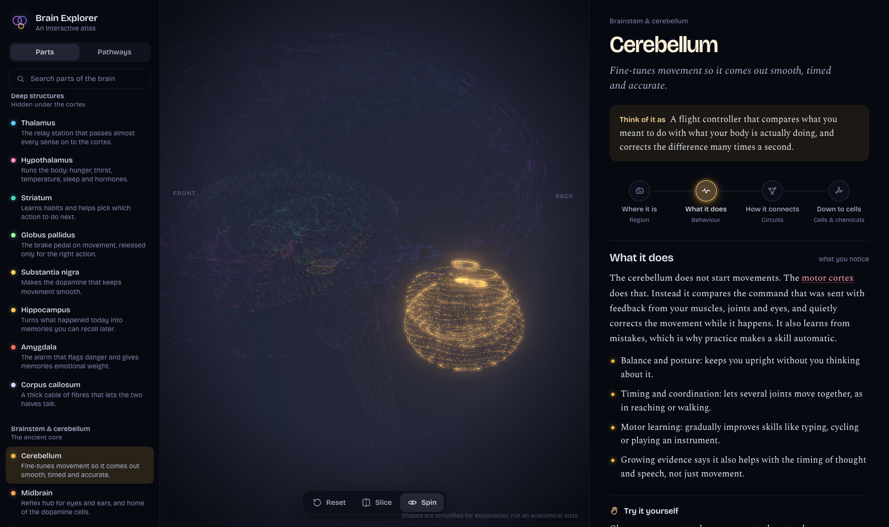

# Brain Explorer

An interactive 3D atlas of the human brain. Pick a part, see it light up inside a glowing point-cloud brain, and read what it does in plain language. Pathways walk you through what happens when you see, move, remember or get scared. Ask lets you type something like "you have a panic attack" and lights up the parts most involved.



## Run it

No build step, no framework. Plain ES modules with Three.js 0.160 from a CDN (via importmap), so you need internet access for the 3D engine.

```sh
cd ~/Desktop/Projects/brain-explorer
npm start
```

Then open http://localhost:5173. `npm start` runs `server.py`, which serves the app on 127.0.0.1 only and falls back to 5174 if 5173 is busy. Set `PORT=5199 npm start` to pick another port.

Ask needs an API key for typed questions. Put it in a `.env` file at the project root (it is gitignored):

```sh
TYPESAFE_API_KEY=your-key-here
```

The key stays on the server. The browser only talks to `/api/ask`, which refuses requests from other sites. Without a key, or with any plain static server, everything works except typed questions. The saved examples on the Ask screen still work.

Check content with:

```sh
npm run validate
```

## What is inside

- 34 structures with shapes, colours, camera views, connections, and beginner-level text
- 17 chemicals across fast transmitters, neuromodulators, and body-wide hormones with 3D fibre trees, density glow, receptor profiles, and interactive synapse and chain views
- 13 cell types across neurons and glia with 3D procedural morphologies, real-time firing animations, and zoom transitions
- 11 pathways in three groups: how you do things, brain chemicals and brain networks
- Ask: type a feeling, condition or activity and get a short sketch of the parts involved
- 4 zoom levels per structure: where it is, what it does, how it connects, down to cells
- Global search across parts, chemicals, and cells from the unified search bar
- Modes in the top bar:
  - Parts: `#/`, `#/s/<id>/<level>`
  - Chemicals: `#/chem`, `#/chem/<id>/<tab>`
  - Cells: `#/cell`, `#/cell/<id>/<tab>`
  - Pathways: `#/pathways`, `#/p/<id>/<step>`
  - Ask: `#/ask`, `#/ask/<question>`
  - Keyboard: arrows, Esc (steps back one level), Space

Shapes are simplified for explanation, not an anatomical atlas. Coordinates: +x is the person's left, +y is up, +z is the front. The brain is about 1.7 units long front to back.

## File map

| File | What it does |
|---|---|
| `index.html` | Layout shell, importmap, fonts |
| `styles.css` | All styling (dark holographic theme, per-part accent colour, badges, steppers) |
| `server.py` | Static server plus the `/api/ask` proxy that holds the API key |
| `src/main.js` | Hash routing, modes, wires sidebar, library, explainer, scene, toolbar |
| `src/scene/brain-scene.js` | 3D engine: point shaders, bloom, focus/highlight, arcs, picking, chemical lens, cell view, body view |
| `src/scene/neuron.js` | Procedural 3D cell morphologies (pyramidal, Purkinje, motor, astrocyte, microglia, etc.) |
| `src/scene/shapes.js` | Point-cloud generators (`cortex`, `ellipsoid`, `tube`, `band`, `parts`, `custom`) |
| `src/scene/noise.js` | Seeded random and Perlin noise |
| `src/content/structures/*.js` | One object per brain part: shape, colour, camera view, connections, text |
| `src/content/chemicals/*.js` | Chemical dictionary: fast transmitters, neuromodulators, and body hormones |
| `src/content/cells/*.js` | Cell dictionary: excitatory, inhibitory, neuromodulatory, and glial types |
| `src/content/pathways/index.js` | Guided tours: steps with focus, route, view, plus a `category` |
| `src/content/pathways/groups.js` | The sections of the pathway library |
| `src/content/ask-presets.js` | Saved Ask answers, checked by hand, that load without the server |
| `src/services/ask.js` | Browser side of Ask: saved answers first, then `/api/ask` |
| `src/content/diagrams/index.js` | Circuit diagrams for the "Down to cells" level |
| `src/content/synapses.js`, `glossary/index.js`, `levels.js`, `groups.js`, `anchors.js` | Supporting data |
| `src/content/index.js` | Merges everything, exports `validate()` |
| `src/ui/*.js` | Explainer, sidebar, chem/cell explainers, synapse stepper, library, Ask screen, SVG diagrams |
| `tools/validate.mjs` | Lists missing text and broken references across parts, chemicals, cells, pathways |

## Adding content

Keep all text beginner-level: short sentences, concrete everyday examples, no em dashes, no hype words. See `CONTENT_PROMPT.md` for the full writing guide.

**Structure:** add an object to one of `src/content/structures/*.js`. Required: `id`, `name`, `group`, `color`, `shape`, `view`, `tagline`, `levels.connects.connections`, `levels.cells.diagram`, `synapse`. Optional: `parent` (nests it in the list), `slice: true` (auto-slices the brain when selected), plus all the text fields.

- Cortical areas use `shape: { type: 'cortex', test: (p) => ... }`, where `p` has `x, y, z, ax` (abs x), `side`, `lobe`, `medial`, `central`.
- Deep parts use `ellipsoid` / `tube` / `band`, or `parts: [...]` to combine several.
- `mirror: true` duplicates the shape on both sides.
- `pattern` can be `gyri`, `fine`, `folia`, `rings`, `fibers`, or `cross`.

**Chemical / Hormone:** add an object to `src/content/chemicals/fast.js`, `modulators.js`, or `hormones.js`. Required: `id`, `name`, `group`, `color`, `tagline`, `analogy`, `overview`, `density`, `receptors`, `life`, `breaks`, `tryIt`. Modulators include `tracts`. Hormones include `axis`, `feedback`, `timescale`.

**Cell:** add an object to `src/content/cells/index.js`. Required: `id`, `name`, `group`, `color`, `tagline`, `analogy`, `transmitter`, `where`, `size`, `morph` (style and seed), `landmarks`, `shape`, `fires`, `chem`, `breaks`.

**Pathway:** add to `src/content/pathways/index.js` with a `category` from `pathways/groups.js`. Each step has `title`, `focus: [ids]`, `route: [[from, to], ...]`, optional `view` and `slice`. Add `summary` plus a 2 to 4 sentence `text` per step that follows the previous one like a story.

**Ask example:** run `npm start`, ask the question, and check the answer against a textbook account. If any part or role is wrong, drop it rather than editing the answer. Otherwise copy the parts into `src/content/ask-presets.js`.

**Ask details:** Ask answers come from Jev, a structured classification model from TypeSafe. `server.py` asks it whether the question is about the brain, then asks for each part whether it is involved and how. Only parts it is very confident about are shown, at most five. The Ask screen mentions Jev once, in a single line under the examples. Keep it that way.

**Diagram:** add to `src/content/diagrams/index.js` (neurons with kind and position, links typed `excite`/`inhibit`/`modulate`, optional bands). Reference it from a structure's `levels.cells.diagram`.

**Glossary term:** add a key to `src/content/glossary/index.js`, then use `[[term]]` in text. Link structures with `{{id}}`.

**Zoom level:** edit `src/content/levels.js`. The explainer reads `levels[id].text` and `bullets` generically. Scene mode per level is `focus`, `activity`, or `wiring`.

Always run `npm run validate` afterwards.
